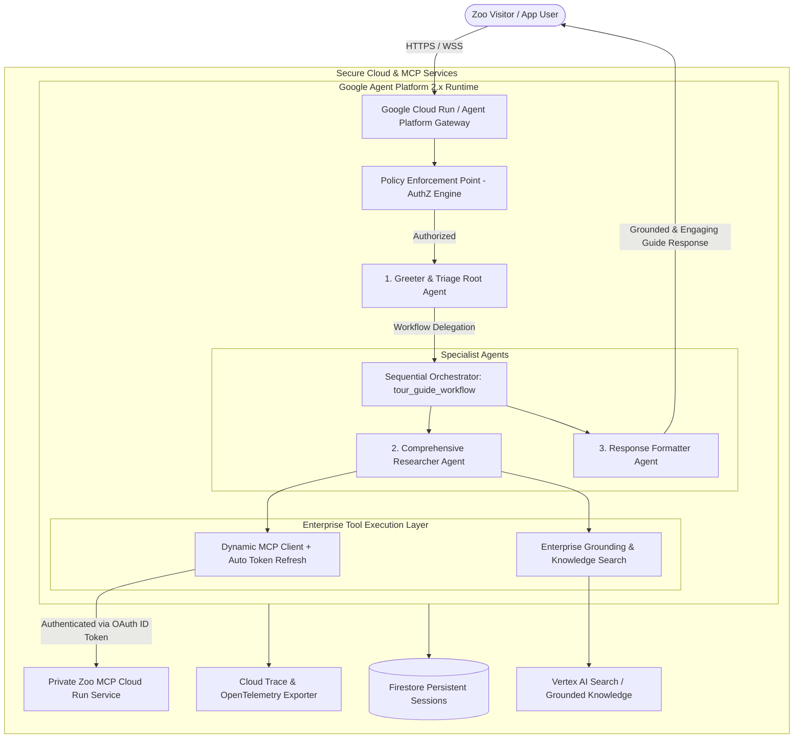

# 🦁 Google Agent Platform: Enterprise Multi-Agent Zoo Tour Guide

A production-grade, enterprise multi-agent system built with **Google Agent Development Kit (ADK) 2.x** and **Google Agent Platform**.

---

## 🏛️ Architecture Overview



---

## 🌟 Key Enterprise Capabilities

| Feature | Enterprise Implementation | Benefit |
| :--- | :--- | :--- |
| **Agent Identity & Dynamic Auth** | `src/security/identity.py` | Automatically acquires & refreshes Google OAuth2 ID tokens with a 5-minute pre-expiry buffer, solving the 1-hour static token bug. |
| **Fine-Grained AuthZ Policy** | `config/authz_policy.json`, `src/security/policy_enforcer.py` | Policy Enforcement Point (PEP) ensuring least-privilege tool execution per subagent role. |
| **Agent & MCP Registry** | `registry/agent_manifest.json`, `config/mcp_registry.yaml` | Declarative specifications conformant with Google Agent Platform registry standards. |
| **Enterprise Grounding** | `src/tools/enterprise_grounding.py` | Replaces fragile unauthenticated scrapers with structured enterprise search and custom headers. |
| **Full Distributed Tracing** | `src/telemetry/tracing.py` | End-to-end OpenTelemetry and Google Cloud Trace span instrumentation. |
| **Model Armor & Guardrails** | `src/security/guardrails.py`, `config/guardrails_policy.yaml` | Input sanitization, prompt injection defense, and PII masking. |

---

## 📂 Project Structure

```
adk-lab-agent-platform/
├── README.md                              # Enterprise system guide & documentation
├── SPECIFICATION.md                       # In-depth architectural specification
├── requirements.txt                       # Python dependencies
├── .env.example                           # Environment configuration template
│
├── config/
│   ├── agent_config.yaml                  # Agent runtime & hyperparameter settings
│   ├── mcp_registry.yaml                  # Declarative MCP server & tool catalog
│   ├── authz_policy.json                  # Fine-grained RBAC/ABAC authorization rules
│   └── guardrails_policy.yaml             # Model Armor & safety filters
│
├── registry/
│   └── agent_manifest.json                # Google Agent Platform registration manifest
│
├── src/
│   ├── __init__.py
│   ├── agent.py                           # Enterprise ADK 2.x agent orchestrator
│   ├── security/
│   │   ├── __init__.py
│   │   ├── identity.py                    # Dynamic token provider & Workload Identity
│   │   ├── policy_enforcer.py             # AuthZ Policy Enforcement Point (PEP)
│   │   └── guardrails.py                  # Model Armor & PII masking
│   ├── telemetry/
│   │   ├── __init__.py
│   │   └── tracing.py                     # OpenTelemetry & Cloud Trace setup
│   └── tools/
│       ├── __init__.py
│       ├── dynamic_mcp.py                 # Dynamic MCP Client with token refresher
│       ├── enterprise_grounding.py        # Enterprise Search & Grounding toolset
│       └── state_manager.py               # Typed state & memory manager
│
├── deploy/
│   ├── setup_iam_authz.sh                 # IAM roles & Agent Identity configuration
│   ├── deploy_agent_platform.sh           # Cloud Run / Agent Platform deployment script
│   └── register_agent.sh                  # Agent Platform registry registration script
│
└── tests/
    ├── test_agent_workflow.py             # Multi-agent integration tests
    ├── test_dynamic_mcp.py                # MCP token refresh & connectivity tests
    └── test_authz_policy.py               # AuthZ policy enforcement unit tests
```

---

## 🚀 Quickstart Guide

### 1. Prerequisites & Setup
Ensure you have active Google Cloud credentials and python installed:

```bash
# Clone the repository
git clone https://github.com/inderanz/adk-lab-agent-platform.git
cd adk-lab-agent-platform

# Install dependencies
pip3 install -r requirements.txt --user

# Configure environment variables
cp .env.example .env
```

### 2. Configure IAM & Agent Identity
Run the automated security script to assign required roles (`roles/aiplatform.user`, `roles/run.invoker`, `roles/cloudtrace.agent`, `roles/datastore.user`):

```bash
chmod +x deploy/*.sh
./deploy/setup_iam_authz.sh
```

### 3. Run Test Suites
Execute the automated test suites:

```bash
# Test AuthZ Policy Enforcement Point
python3 -m unittest tests/test_authz_policy.py

# Test Dynamic Token Provider & MCP Connectivity
python3 -m unittest tests/test_dynamic_mcp.py

# Test Multi-Agent Workflow
python3 -m unittest tests/test_agent_workflow.py
```

### 4. Deploy to Google Agent Platform / Cloud Run
Deploy with full OpenTelemetry tracing, Cloud Trace integration, and ADK Developer UI:

```bash
./deploy/deploy_agent_platform.sh
```

### 5. Register in Agent Platform Catalog
```bash
./deploy/register_agent.sh
```

---

## 📄 License
Apache 2.0 - Developed for Google Agent Platform & ADK 2.x.