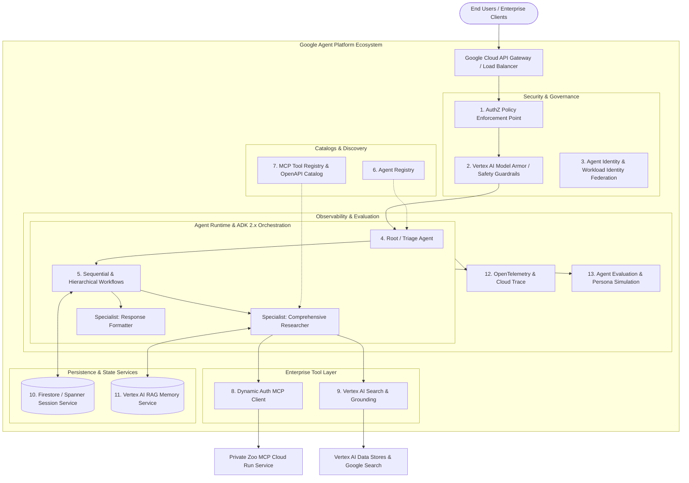

# 📘 Enterprise Specification: Google Agent Platform & ADK 2.x Architecture

This specification outlines the end-to-end architecture for building, securing, and operating enterprise multi-agent applications using **Google Agent Platform** and **Agent Development Kit (ADK) 2.x**.

---

## 🏛️ System Overview

Google Agent Platform provides a comprehensive ecosystem for managing enterprise AI agents across their full lifecycle—from development and testing to security, deployment, registration, and observability.

---

## 🔑 Core Services & Enterprise Capabilities

### 1. Agent Runtime (ADK 2.x)
- **Framework**: Google Agent Development Kit (ADK) 2.x with native `LlmAgent`, `SequentialAgent`, and `ToolContext`.
- **Runtime Environment**: Containerized Serverless Agent Engine hosted on Google Cloud Run with autoscaling (0 to N) and WebSocket / Server-Sent Events (SSE) streaming support.
- **Model Backend**: Vertex AI Gemini 3.7 Flash (`gemini-3.7-flash`) with enterprise throughput and regional compliance.

---

### 2. Agent Identity & Workload Identity Federation
- **Principle of Least Privilege**: Each agent workflow executes under a distinct Google Cloud Service Account (e.g., `agent-runtime@<project-id>.iam.gserviceaccount.com`).
- **Dynamic Credential Refresh**: Solves the static token expiration bug by using an asynchronous `TokenProvider` that automatically acquires and refreshes Google OAuth2 ID tokens with a 5-minute proactive buffer before the 60-minute expiration window.
- **Service Identity Access**: Explicit IAM roles:
  - `roles/aiplatform.user` for Vertex AI model inferences.
  - `roles/run.invoker` strictly scoped to private downstream MCP Cloud Run endpoints.
  - `roles/datastore.user` for Firestore session state management.

---

### 3. Agent Registry & MCP Tool Registry
- **Declarative Manifests**:
  - `registry/agent_manifest.json`: Defines agent metadata, supported modalities, system instructions, pricing tier, SLA, and endpoint routes.
  - `config/mcp_registry.yaml`: Catalog of Model Context Protocol (MCP) servers, supported transport protocols (`streamable-http`, `stdio`), authentication schemas, and tool schemas.
- **Dynamic Tool Discovery**: Allows agents to introspect capabilities at runtime without hardcoded tool registrations.

---

### 4. Agent Authorization (AuthZ) Policy Engine
- **Policy Enforcement Point (PEP)**: Intercepts all tool execution requests before invoking underlying APIs.
- **Attribute-Based Access Control (ABAC)**: Defined in `config/authz_policy.json`.
  - Restricts specific subagents from invoking privileged tools (e.g., `response_formatter` is prevented from triggering database writes or direct MCP queries).
  - Enforces role-level filtering and parameter sanitization.

---

### 5. Enterprise Grounding vs. Web Scraping
- **Vertex AI Search & Google Grounding**: Completely eliminates unreliable, unauthenticated third-party scrapers (e.g., LangChain Wikipedia).
- **Verifiable Citations**: Every fact retrieved is grounded with verifiable citation metadata, source URLs, and confidence scores.

---

### 6. Durable Session Persistence & Vertex RAG Memory
- **Session Backend (`--session_service_uri`)**: High-throughput Cloud Firestore / Cloud Spanner session store ensuring multi-turn conversation context is preserved across distributed Cloud Run instances.
- **Long-Term Memory (`--memory_service_uri`)**: Connected to Vertex AI RAG Memory Service (`rag://...`) enabling long-term personalization, visitor history recall, and preference tracking.

---

### 7. Safety, Guardrails & Vertex AI Model Armor
- **Input Sanitization**: Prompt injection detection, jailbreak prevention, and toxicity filtering.
- **Output Validation & PII Redaction**: Automatic redacting of sensitive visitor information before storing in state or session logs.

---

### 8. Observability & Distributed Tracing (OTel + Cloud Trace)
- **Standardized Spans**: Emits OpenTelemetry traces (`--trace_to_cloud`, `--otel_to_cloud`) across:
  - Agent turn lifecycle (`agent.turn`).
  - Subagent routing and handoffs (`agent.handoff`).
  - Tool executions (`tool.mcp.execute`, `tool.grounding.search`).
  - LLM completion calls (`llm.inference`).
- **Cloud Operations Integration**: Pre-integrated with Google Cloud Trace, Cloud Logging, and Cloud Monitoring for real-time SLA metrics.

---

### 9. Agent Evaluation & Continuous Benchmarking
- Built-in test suites utilizing persona simulators to validate task completion, grounding faithfulness, and AuthZ policy enforcement prior to deployment.
